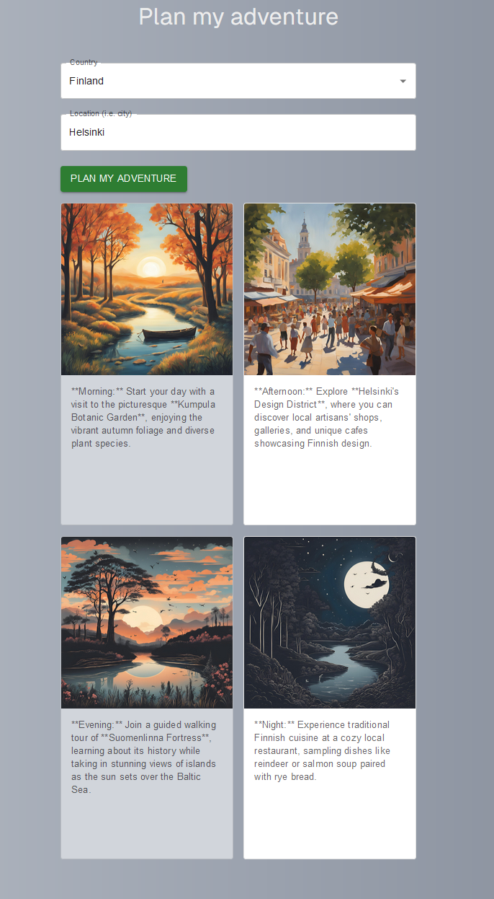
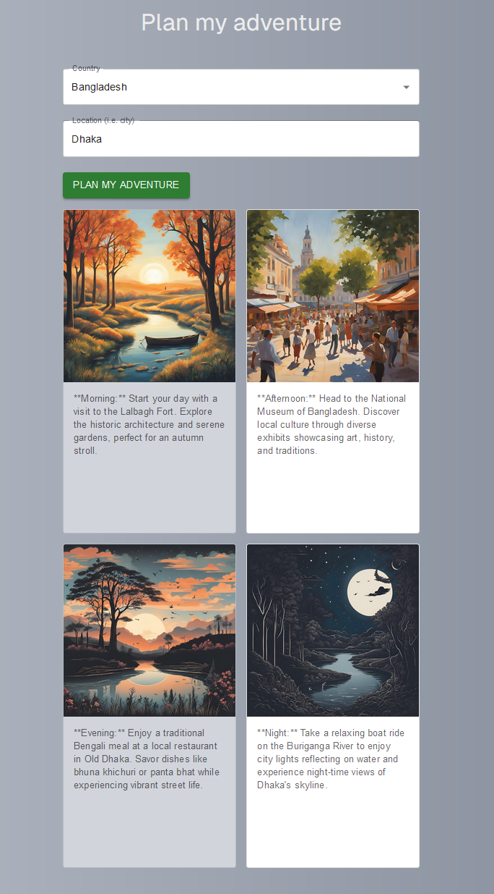

# Plan My Adventure project

This project is a proof of concept that leverages OpenAI to suggest daily activities in user-selected cities. It serves as a personal side project aimed at exploring the effectiveness of OpenAI in providing useful recommendations. The application can be deployed and demonstrated via Vercel. Additionally, it can be easily refactored to suggest a wide range of activities or recommendations.

## Technologies

- NextJS
- NodeJS
- ReactJS
- TypeScript
- Vercel (deployment)
- Tailwind CSS
- GitHub Actions
- OpenAI
- External API integrations
- MaterialUI

## Installation

To install the Plan My Adventure project, follow these steps:

1. **Clone the repository**:
    ```sh
    git clone https://github.com/jannepaakkari/Adventure.git
    ```

2. **Navigate to the project directory**:
    ```sh
    cd Adventure
    ```

3. **Install the dependencies**:
    ```sh
    npm install
    ```

4. **Set your OpenAI API Key**:
    - Create a `.env.local` file in the root directory.
    - Add the following line to the file:
      ```sh
      OPENAI_API_KEY="your_key"
      ```
    *Note: This project does not include the `.env.local` file.*

5. **Start the development server**:
    ```sh
    npm run dev
    ```

6. **Open the application**:
    - Navigate to [http://localhost:3000](http://localhost:3000) in your browser.

Alternatively, you can deploy the application on Vercel. Ensure you set up your `OPENAI_API_KEY` in the Vercel environment settings.

## Screenshots


